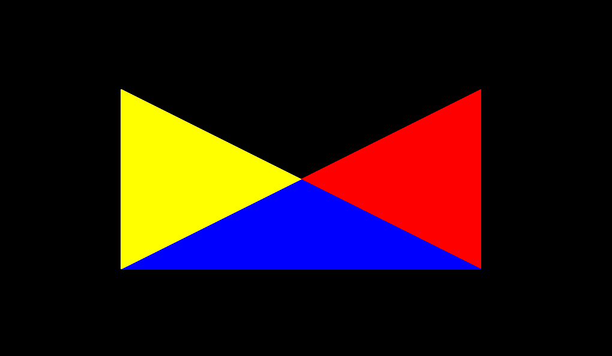

# Triangulation

Simple ear clipping implementation to triangulate non-convex polynomials. 

Related documentation can be found at:
* https://www.geometrictools.com/Documentation/TriangulationByEarClipping.pdf

Given input polygon, it returns a std::vector of convex polygons (triangles) which the input decomposes to.

## Example
Starting with an input shape that is non-convex:

Ear clipping gives the triangulation:
